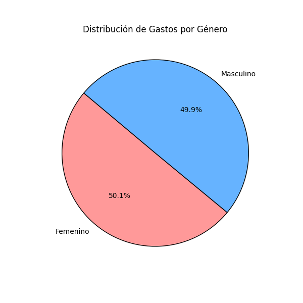

# **DOCUMENTACIÓN**
##### ***SISTEMAS ORGANIZACIONALES Y GERENCIALES 2***
___

## **INDICE**
- [**RESPONSABLES**](#responsables)
- [**ACERCA DE**](#acerca-de)
- [**PLANIFICACION**](#planificacion)
- [**PROCESO DE ANALISIS**](#proceso-de-analisis)
- [**METODOLOGIA**](#metodologia)
- [**MODELO DE BASE DE DATOS**](#modelo-de-base-de-datos)
- [**REPORTE DE DATOS**](#reporte-de-datos)
- [**PREGUNTAS PLANTEADAS**](#preguntas-planteadas)
- [**CONCLUSIONES**](#conclusiones)
- [**RECOMENDACIONES**](#recomendaciones)

___
## **RESPONSABLES**

|No.| Nombre | Carnet |
|:-:| ------ | ------ |
|1| Eddy Fernando Díaz Galindo| 201906558 |
|2| Saúl Jafet Menchú Recinos | 201906444 |
___
## **ACERCA DE**
En esta práctica se detalla y explica el análisis de datos por meido de un archivo CSV, el objetivo de este anális fue reconocer los insights derivados del análisis y cómo estos ayudan a la toma de desiciones estratégicas, mejorar la eficiencia operativa y aumentar la ventaja competitiva en el mercado.

___
## **PLANIFIACION**
#### *División de tareas*
Para la realización de esta práctica, las tareas fueron dividadas de la siguiente manera:
|No.| Tarea | Nombre |
|:-:| ------ | ------ |
|1| Creación de BBDD | `Saúl` |
|2| Modelo de BBDD | `Eddy` |
|3| Depuración | `Saúl` |
|4| Carga | `Eddy` |
|5| Análisis de datos (1-3)| `Saúl` |
|6| Análiss de datos (4-5) | `Eddy` |
|7| Documentación | `Saúl` |
|8| Documentación | `Eddy` |


#### *Herramientas y tecnologías*
Para la realización de esta práctica se optó por usar `python` y `pandas` como lenguaje de programación y análisis de datos respectivamente. Se optaron estas tecnologías por su familiaridad en proyectos y trabajos anteriores, también por la facilidad en el análisis de datos, la conexión con la BBDD y facilidad en la lectura de código. 

Para el almacenamiento de datos (base de datos) se optó por ulitilizar el servicio de `RDS` de `AWS` por su facilidad de uso en la cración de la misma y por la familiaridad con el servicio.

___
## **PROCESO DE ANALISIS**
#### *Limpieza y prepación de datos*
Para la limpieza y preparación de datos se realizó de la siguiente manera:
Carga de datos:
1. Se útilizó Pandas para cargar el archivo CSV en un DataFrame, permitienda una facilidad en el manejo y transformación de datos.
2. Se eliminaron registros duplicados globalmente para evitar datos redundantes.
3. Se aplicó un filtro adicional para eliminar registros duplicados basados en customer_id y order_id, asegurando que no se registren pedidos repetidos.
4. Se reemplazaron valores nulos en columnas como customer_gender, product_category, product_name, payment_method y shipping_region con "Desconocido".
5. Para columnas numéricas como customer_age, product_price, quantity y order_total, convertimos valores inválidos en NaN y luego los reemplazamos con valores predeterminados (0).
6. Se convirtió la fecha de compra (purchase_date) al formato adecuado (datetime).
7. Se eliminaron filas con valores faltantes en columnas clave (customer_id, product_price, quantity y order_total), ya que estos datos son esenciales para el análisis y la integridad de la base de datos.

#### *Decisiones tomadas durante el análisis exploratorio*
Durante el análisis de datos se tomaron las siguientes decisiones:
- Validación de datos inconsistentes: Se usaron conversiones forzadas (pd.to_numeric(errors='coerce')) para detectar valores no numéricos en columnas críticas y reemplazarlos con valores apropiados o eliminarlos.
- Normalización de datos categóricos: Se sustituyeron valores nulos en campos de texto con "Desconocido" para evitar problemas de análisis posteriores.
- Estandarización de fechas: Se validaron y transformaron fechas al formato correcto, previniendo errores en consultas temporales o cálculos de tendencias.
- Verificación de integridad referencial: Antes de insertar datos en la base de datos, verificamos la existencia previa de clientes, productos y órdenes para evitar duplicaciones y asegurar consistencia


#### *Desafíos encontrados*
- Datos incompletos y valores nulos: Se implementaron reemplazos con valores predeterminados o eliminaciones selectivas cuando los datos eran críticos.
- Errores en tipos de datos: Se aplicaron conversiones y verificaciones previas antes de la inserción en la base de datos, descartando valores inválidos cuando fue necesario.
- Duplicación de datos en múltiples tablas: Se implementaron consultas previas (SELECT COUNT(*)) antes de insertar registros en CUSTOMER, PRODUCT y ORDER_T, asegurando que no se registraran datos repetidos.
- Errores en la inserción de datos en la base de datos: Se utilizó manejo de excepciones en SQLAlchemy (try-except) para capturar y registrar errores, permitiendo identificar y corregir problemas en la estructura de los datos antes de reintentar la carga.

___
## **METODOLOGIA**
Para seleccionar las gráficas más apropiadas nos basamos en los tipos de datos obtenidos y cómo se relacionan. Por lo tanto para cada gráfica:

#### 1. **Análisis de distribución de datos (Histogramas y Boxplots)**
**Gráfica elegida**: Histogramas
**Justificación**: Permiten visualizar la frecuencia de diferentes rangos de valores, facilitando la identificación de patrones, sesgos y valores atípicos.

**Gráfica elegida**: Boxplots (diagramas de caja y bigotes)
**Justificación**: Ayudan a detectar valores atípicos y la dispersión de los datos en variables numéricas como customer_age y order_total.
#### 2. **Análisis de tendencias de ventas en el tiempo (Gráficos de líneas)**
**Gráfica elegida**: Gráfico de líneas
**Justificación**: Muestra de manera clara cómo evolucionan las ventas por día, mes o año, facilitando la identificación de tendencias ascendentes o descendentes.

#### 3. **Segmentación de clientes por género y edad (Gráficos de barras y de pastel)**
**Gráfica elegida**: gráfica de barras
**Justificación**: Para comparar la cantidad de clientes en diferentes grupos de edad.
**Gráfica elegida**: Gráfico de pastel
**Justifiación**:Para representar la proporción de clientes por género, permitiendo visualizar fácilmente qué porcentaje de clientes es masculino, femenino o desconocido.

#### 4. **Relación entre precio del producto y cantidad comprada (Gráficos de dispersión)**
**Gráfica elegida**: Gráfica de dispersión (scatter plot)
**Justificación**: Permite observar si hay una tendencia clara entre precios más bajos y mayor volumen de compra, o si la relación no es significativa.

#### 5. **Análisis de regiones con mayor cantidad de pedidos (gráfica de barras)**
**Gráfica elegida**: Gráfico de barras horizontal 
**Justificación**: Para comparar rápidamente el número de pedidos por región.

___
## **MODELO DE BASE DE DATOS**
<p align="center">
  
</p>

___
## **REPORTE DE DATOS**
Tras el análisis de datos se obtuvo las siguientes gráficas:

<p align="center">
  
</p>


<p align="center">
  
</p>


<p align="center">
  
</p>


<p align="center">
  
</p>


<p align="center">
  
</p>


<p align="center">
  
</p>


<p align="center">
  
</p>


<p align="center">
  
</p>


<p align="center">
  
</p>

___
## **PREGUNTAS PLANTEADAS**
#### **¿Cómo podrían los insights obtenidos ayudar a diferenciarse de la competencia?**

*Los insights obtenidos permiten a la empresa adoptar un enfoque más personalizado y estratégico en sus operaciones. Por ejemplo: Ofrecer productos y promociones adaptadas a los grupos de edad y regiones más rentables.*

*Mejorar la experiencia del cliente mediante la anticipación de demandas estacionales y la optimización del inventario.*

*Esto crea una ventaja competitiva al proporcionar un servicio más relevante y eficiente en comparación con competidores que no utilizan análisis de datos.*

#### **¿Qué decisiones estratégicas podrían tomarse basándose en este análisis para aumentar las ventas y la satisfacción del cliente?**
1. **Implementar campañas promocionales estacionales:**
*Basándose en los patrones de ventas mensuales, la empresa podría lanzar ofertas especiales durante los meses de menor actividad (como enero-febrero) para incentivar las compras*

2. **Mejorar la oferta de productos menos populares:**
*Para los productos menos vendidos, se podrían realizar estudios de mercado para entender por qué no son atractivos y ajustar su diseño, precio o posicionamiento.*

3. **Fomentar la lealtad de los clientes:**
*Implementar programas de fidelización dirigidos a los grupos de edad que gastan más (26-35 años) para retener a estos clientes valiosos*

#### **¿Cómo podría este análisis de datos ayudar a la empresa a ahorrar costos o mejorar la eficiencia operativa?**
1. **Reducción de exceso de inventario:**
*Al identificar los productos menos vendidos, la empresa puede evitar sobrestock y reducir costos asociados con el almacenamiento.*
2. **Optimización logística:**
*Conocer las regiones con mayor demanda permite optimizar las rutas de envío y reducir costos de transporte.*
3. **Asignación eficiente de recursos:**
*Priorizar la inversión en categorías y regiones más rentables asegura un uso más eficiente del presupuesto de marketing y operaciones.*


#### **¿Qué datos adicionales recomendarían recopilar para obtener insights aún más valiosos en el futuro?**
1. **Datos demográficos más detallados:**
*Recopilar información sobre ingresos, ocupación y nivel educativo de los clientes para entender mejor sus hábitos de compra.*
2. **Comportamiento en línea:**
*Analizar datos de navegación en el sitio web, como páginas visitadas, tiempo de permanencia y tasas de abandono del carrito, para identificar oportunidades de mejora en la experiencia de usuario.*
3. **Retroalimentación de los clientes:**
*Implementar encuestas de satisfacción para comprender las razones detrás de las devoluciones, reseñas negativas o abandonos de compra.*
4. **Tendencias de mercado externas:**
*Monitorear datos de la competencia, tendencias de moda y eventos económicos que puedan influir en las preferencias de los consumidores.*

___
## **CONCLUSIONES**
1. **Relación entre la edad del cliente y el total de la orden:**
El análisis de correlación entre la edad del cliente y el total de la orden muestra una relación débil (coeficiente de correlación cercano a cero). Esto sugiere que la edad no es un factor determinante en el monto gastado por los clientes. Sin embargo, el gasto total por grupo de edad indica que ciertos rangos de edad (como 26-35 años) tienden a gastar más, lo que podría estar relacionado con su poder adquisitivo o preferencias de consumo.

2. **Distribución de ventas por categoría de producto y región:**
Las categorías de productos como "Ropa" y "Calzado" generan las mayores ventas, mientras que las regiones como "Oeste" y "Este" son las más rentables. Esto sugiere que estas categorías y regiones son áreas clave para enfocar estrategias de marketing y optimización de inventario.

3. **Patrones de ventas mensuales:**
Los meses con mayores ventas (por ejemplo, diciembre) coinciden con temporadas de compras navideñas, mientras que los meses con menores ventas (como enero o febrero) podrían estar influenciados por factores como la post-temporada o menor actividad económica. Este patrón estacional debe considerarse al planificar campañas promocionales.

4. **Productos más vendidos y menos vendidos:**
Los productos más populares, como "Sweater-Chaqueta" y "Zapatos formales", reflejan las preferencias actuales de los clientes, mientras que los productos menos vendidos ("Desconocido") podrían ser candidatos para descuentos o eliminación del inventario. Además, existe una clara preferencia por productos prácticos y de uso cotidiano.

___

1. **Personalización de ofertas basadas en grupos de edad:**
Dado que los clientes de 26-35 años gastan más, la empresa podría diseñar campañas específicas para este grupo, como ofertas exclusivas o recomendaciones personalizadas de productos que se ajusten a sus intereses.
2. **Optimización del inventario por región:**
Identificar las categorías de productos más populares en cada región (por ejemplo, "Calzado" en el Oeste) y ajustar el inventario en consecuencia para reducir costos de almacenamiento y maximizar las ventas.

____
## **RECOMENDACIONES**
```bash
estudiante ~$ Saul Menchu
[#############....] (99%) Processing...
```
